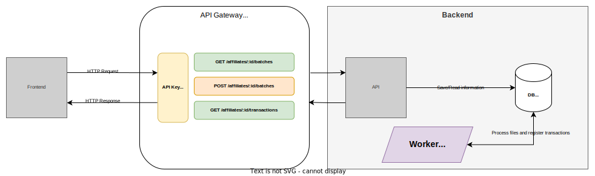

# Affiliates Backoffice
[](https://github.com/allbarbos/affiliates-backoffice/actions/workflows/test.yaml)   [](https://github.com/allbarbos/affiliates-backoffice/actions/workflows/lint.yaml)   [](https://github.com/allbarbos/affiliates-backoffice/actions/workflows/sec.yaml)

## Arquitetura do projeto


## Frontend
Responsável em servir uma interface para que seja possível:  

- Realizar upload de um arquivo de vendas.
- Apresentar as transações/vendas realizadas e o cálculo das mesmas.

## API Gateway
Responsável em expor as rotas publicamente e validar se determinada API Key pode consumir as rotas, seu papel aqui é resolver as complexidades transversais que o backend não precisaria implementar, como políticas de throttling, response caching, autorização/autenticação e etc.

## Backend API
API para atender o frontend através das rotas:

`GET /v1/affiliates/:affiliateID/batches`  
Possibilita buscar todos os arquivos de um afiliado importado no sistema.  

`POST /v1/affiliates/:affiliateID/batches`  
Importa o arquivo de vendas de um afiliado.  

`GET /v1/affiliates/:affiliateID/transactions`  
Possibilita buscar todas as transações realizadas de um afiliado.  

Mais detalhes podem ser consultados no [OpenAPI](./openapi.yaml) ou acessando via [interface localmente](http://localhost:9002).

### Detalhes de implementação
- Em todo log gerado é setado o correlation ID, dessa forma se for configurado alguma ferramenta de ingestão de logs será possível correlacionar ponta a ponta.


## Backend Worker
Uma vez importado um arquivo de lote via API esse serviço realiza seu processamento assíncronamente, possibilitando atingirmos um bom tempo de resposta na API e escalabilidade/rapidez no processamento dos arquivos.  

### Detalhes de implementação
- Para atingir a rapidez de processamento o worker utiliza o poder do paralelismo + go routine.
- As transações são inseridas nos banco de dados utilizando `Batch Insert` para garantir mais eficiência no banco de dados.
- Em todo log gerado é setado o correlation ID, dessa forma se for configurado alguma ferramenta de ingestão de logs será possível correlacionar ponta a ponta.

## Como rodar o projeto
Todos os serviços estão dockerizado, portanto é necessário que tenha instalado em seu ambiente, basta executar o comando abaixo que o mesmo se encarrega de preparar todo ambiente:

```sh
make run
```

Para acompanhar a subida dos serviços basta executar `docker-compose ps`, quando as dependências estiverem `healthy` será possível utilizar.
